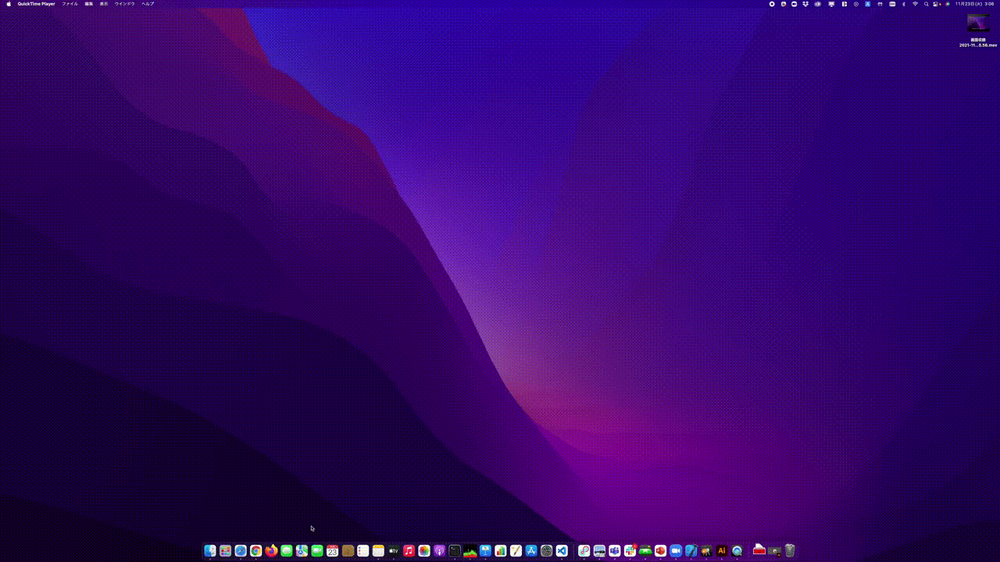

# handable
handable is an application that draws only the user's hand on the entire desktop screen. During a presentation, the user can use his or her hands to communicate various gestures.

## Dependencies (npm)
 * electron
 * electron-builder